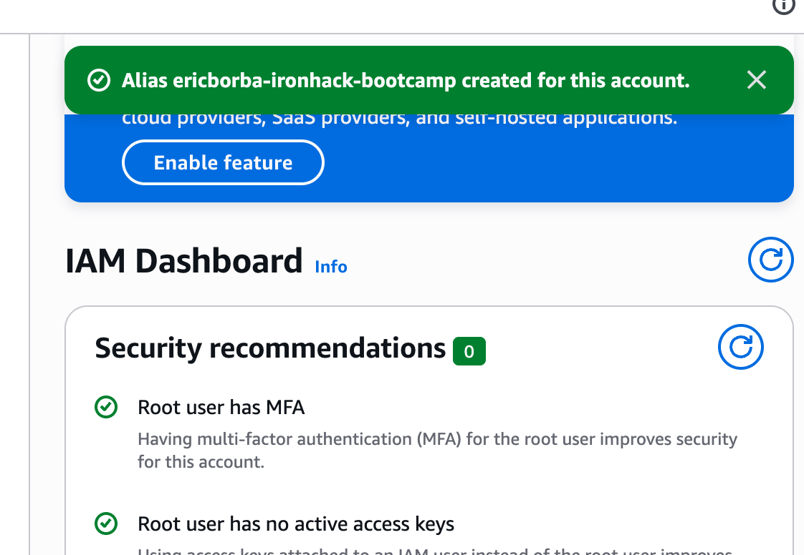
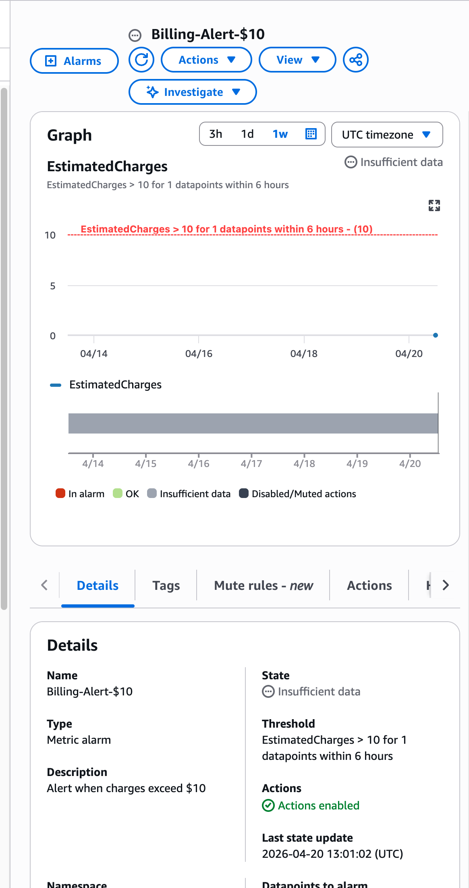
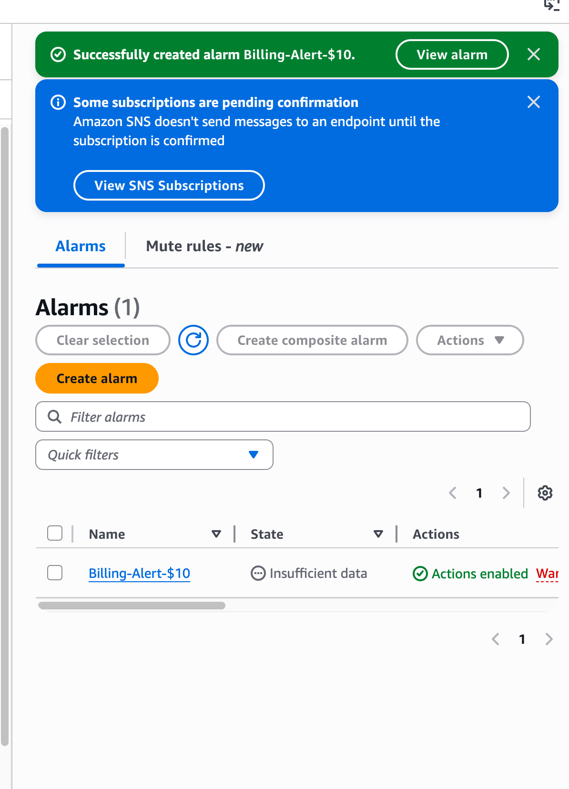
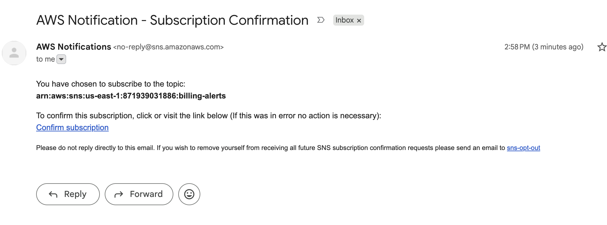
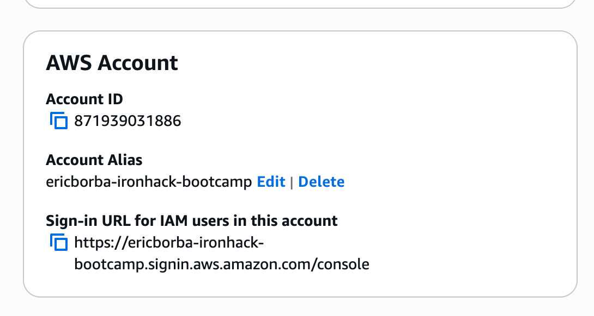
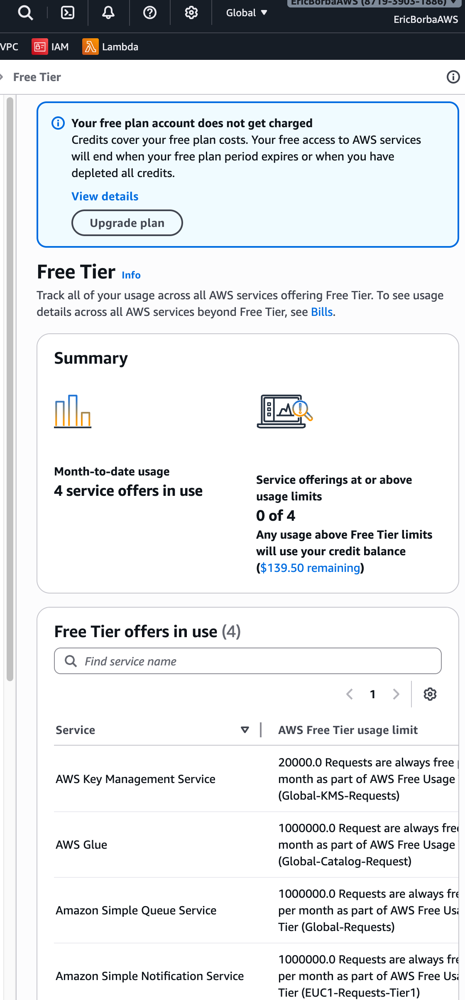

# AWS Account Setup Lab - Solution

**Student Name:** [Eric Rodrigues Borba]  
**Date Completed:** [20/04/2026]

---

## Exercise 1: MFA Configuration

### Screenshot:

### Notes:
- Authenticator app used: [Microsoft Authenticator]
- MFA setup completed successfully: [Yes]
- Backup codes saved: [Yes]

---

## Exercise 2: Billing Alerts

### Screenshots:

**Billing Preferences:**

**Billing Alarm:**

**SNS Confirmation:**

### Configuration Details:
- Alert threshold: $[10]
- Email confirmed: [Yes]
- Additional thresholds created (bonus): [Yes / No - if yes, list amounts]

---

## Exercise 3: Account Alias

### Screenshot:

### Account Details:
- **Account Alias:** [ericborba-ironhack-bootcamp]
- **Sign-In URL:** `https://ericborba-ironhack-bootcamp.signin.aws.amazon.com/console`
- **Tested successfully:** [Yes]

---

## Exercise 4: Free Tier Dashboard

### Screenshot:

### Current Free Tier Usage Summary:

| Service | Current Usage | Free Tier Limit | Status |
|---------|--------------|-----------------|--------|
| AWS Key Management Service | 4 requests | 20k requests/month | [Green] |
| AWS Glue | 39 requests | 1M requests/month | [Green] |
| Amazon Simple Queue Service | 4 requests | 1M requests/month | [Green] |
| Amazon Simple Notification Service | 3 requests | 1M requests/month | [Green] |
| [Other services...] | | | |

### Notes:
- Any services approaching limits? [No]
- Any unexpected usage? [No]

---

## Exercise 5: Reflection Questions

### 1. Why is MFA important even for a personal learning account?

**Your Answer:**
[MFA is especially critical because, without it, anyone who gains access to my AWS account could freely create or delete services and rack up enormous charges. Costs I might only discover on the next billing cycle if I don't have proper alerts in place.]

---

### 2. What would happen if you left your root user unprotected?

**Your Answer:**
[The risks are similar to those described above. A compromised root user means full, unrestricted access to the account. User data could be exposed, services and data could be deleted, and significant financial damage could follow since whoever took control would be free to do anything they want within the account.]

---

### 3. How do billing alerts help prevent unexpected charges?

**Your Answer:**
[Billing alerts act as a proactive safeguard against unexpected cost changes. They notify whoever is responsible for monitoring the account the moment spending reaches a threshold that was deliberately configured beforehand. Rather than discovering a problem after the fact, this approach gives you an early warning that something may already be going wrong.]

---

### 4. What threshold did you set for your billing alert and why?

**Your Answer:**
[$10 feels like a reasonable middle ground. It's low enough to catch problems before they spiral into something unmanageable, but high enough to avoid false alarms from everyday usage. A threshold that's too small would trigger on any normal activity and quickly become noise. Setting multiple thresholds is also a smart practice: if costs jump from one level to another in a short period of time, that pattern alone can signal that something unusual is happening.]

---

### 5. What is your account alias and why did you choose it?

**Your Answer:**
- **Alias:** [ericborba-ironhack-bootcamp]
- **Reasoning:** [The alias I chose is professional because it clearly identifies both the person who configured it and the context it belongs to. In this case, the Ironhack bootcamp. It's specific, recognizable, and follows a naming convention that makes the account easy to identify at a glance.]

---

### 6. What services are you currently using according to the Free Tier dashboard?

**Your Answer:**
[The services listed were AWS Key Management Service, AWS Glue, Amazon Simple Queue Service, and Amazon Simple Notification Service, with current usage of 4, 39, 4, and 3 requests respectively. I wasn't surprised by these numbers — the account is brand new, and the monthly free-tier limits for those services are 20,000, 1,000,000, 1,000,000, and 1,000,000 requests respectively, so current consumption is nowhere near those thresholds.]

---

## Bonus Challenges Completed (Optional)

### Challenge 1: Multiple Billing Alert Thresholds

- [ ] $5 threshold
- [ ] $25 threshold
- [ ] $50 threshold

**Screenshots (if completed):**
[Add screenshots here]

---

### Challenge 2: CloudTrail Enabled

- [ ] CloudTrail enabled
- [ ] Logging to S3 configured

**Notes:**
[Add any notes about CloudTrail setup]

---

### Challenge 3: AWS Trusted Advisor Reviewed

- [ ] Accessed Trusted Advisor
- [ ] Reviewed recommendations

**Key recommendations found:**
[List any recommendations you found]

---

## Lessons Learned

**What was the most challenging part of this lab?**

[AWS appears to have made some recent changes to its interface, so a few of the lab instructions didn't quite match what I was actually seeing on screen. Navigating those discrepancies and figuring out where things had moved took some extra effort.]

---

**What would you do differently next time?**

[I'd spend some time exploring the AWS interface before diving into the exercise itself. Both to spot anything that might be out of date and to build some muscle memory around where the different services and settings are located.]

---

**What security practices will you implement going forward?**

[I plan to set up multiple billing thresholds so I can track how costs evolve over time, rather than only being alerted at a single point. This way, for any system I'm responsible for monitoring, I'll have a clearer picture of spending trends and can catch unusual patterns earlier.]

---

## Checklist Before Submission

- [x] All required screenshots captured and saved
- [x] Screenshots are clear and show relevant information
- [x] All reflection questions answered thoroughly
- [x] Account alias documented
- [x] Free Tier usage documented
- [x] Work committed to Git
- [x] Pull request created
- [x] PR URL submitted to Student Portal

---

**Lab Completed By:** [Eric Rodrigues Borba]  
**Date:** [20/04/2026]
